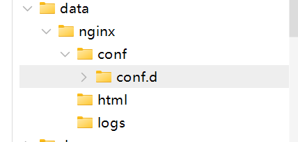

## 复制配置文件
Linux
```
docker container cp Nginx:/etc/nginx/nginx.conf /data/nginx/conf
docker container cp Nginx:/etc/nginx/conf.d/default.conf /data/nginx/conf/conf.d/default.conf
docker docker container cp Nginx:/usr/share/nginx/html /data/nginx/html

```
Windows
```
docker container cp Nginx:/etc/nginx/nginx.conf nginx/conf
docker container cp Nginx:/etc/nginx/conf.d/default.conf nginx/conf/conf.d/default.conf
docker container cp Nginx:/usr/share/nginx/html nginx/html
```



## 启动
Linux
```
docker run \
--restart=always \
--name Nginx \
-p 80:80 \
-v /data/nginx/conf/nginx.conf:/etc/nginx/nginx.conf \
-v /data/nginx/conf/conf.d:/etc/nginx/conf.d \
-v /data/nginx/logs:/var/log/nginx \
-v /data/nginx/html:/usr/share/nginx/html \
--privileged=true \
-d nginx
```
Windows
```
// Windows挂载卷需要使用绝对路径
docker run --restart=always --name Nginx -p 80:80 -v D:/桌面/ChatGPT/dev-ops/nginx/conf/nginx.conf:/etc/nginx/nginx.conf -v D:/桌面/ChatGPT/dev-ops/nginx/conf/conf.d/default.conf:/etc/nginx/conf.d/default.conf -v D:/桌面/ChatGPT/dev-ops/nginx/logs:/var/log/nginx -v D:/桌面/ChatGPT/dev-ops/nginx/html:/usr/share/nginx/html --privileged=true -d nginx
```